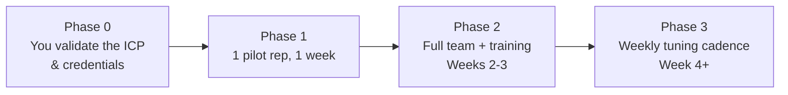
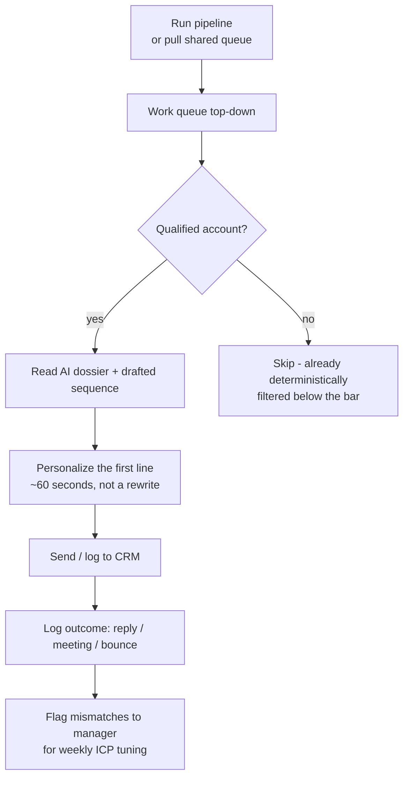

# Rolling this out to an SDR team

A playbook for a Head of Sales / SDR manager standing up `ai-sdr-toolkit`
as the team's daily prospecting motion — not just running the demo once.

## 1. Before you touch the team: set it up for real

The bundled `examples/icp.yaml` and demo dataset exist so anyone can try
the pipeline in five minutes. Before a rep touches it, replace both with
your actual targeting:

```bash
cp examples/icp.yaml icp/production.yaml
```

Edit `icp/production.yaml`:
- `target_industries`, `min_employees`/`max_employees` — your real ICP
- `signal_keywords` — the job titles, tech terms, and homepage language
  that actually correlate with a good-fit account for *your* product
- `signal_type_weights`, `qualification_threshold`, `nurture_threshold`
  — start with the defaults, then tune from real outcomes (see §5)

Then wire up credentials (see [.env.example](../.env.example)):

| Variable | Needed for |
|---|---|
| `ANTHROPIC_API_KEY` | `--live` mode (real dossiers/sequences instead of the offline mock) |
| `HUBSPOT_ACCESS_TOKEN` | Pushing qualified accounts straight into HubSpot |

Run it yourself once, end to end, before anyone else sees it:

```bash
sdr-toolkit prospect --icp icp/production.yaml --live --export out/queue.csv
```

Read the output like a rep would. If the top of the queue doesn't pass
your gut check, tune the ICP file before rollout — garbage signals in
means garbage-prioritized accounts out, no matter how good the drafted
copy is.

## 2. Rollout in three phases, not one big-bang launch



**Phase 1 — Pilot (1 rep, ~1 week).** Pick your most technically curious
SDR. Have them run the pipeline daily and work the queue top-down instead
of their usual list-building process. Compare against their own recent
baseline: accounts researched/day, sequences sent/day, reply rate. This
is where you catch a badly-tuned ICP before it wastes the whole team's
time.

**Phase 2 — Team rollout (weeks 2-3).** Run the training session in §3.
Every rep gets the pipeline, the production ICP file, and clear
expectations (§4) on what to trust vs. what to personalize.

**Phase 3 — Scale & tune (week 4+).** Weekly review of the funnel metrics
per rep (§5). This is a live system, not a one-time setup — the ICP file
should change as you learn what actually books meetings.

## 3. Training session (~60 minutes)

| Time | Segment | What happens |
|---|---|---|
| 10 min | Why | Frame the problem: rep time is the scarce resource. This pipeline's whole design is spending that time (and LLM cost) only on accounts that clear a bar — see the "score gates spend" note in the [README](../README.md#design-notes). |
| 15 min | Live walkthrough | Run `sdr-toolkit demo` on screen. Walk the room through: signal → score → dossier → drafted sequence → funnel. Show a *rejected* account too, not just the winners — that's the point. |
| 15 min | Hands-on | Each rep runs `sdr-toolkit prospect --icp icp/production.yaml --live --limit 10` on their own laptop against their assigned segment. |
| 10 min | Reading the queue | Explain `icp_fit` vs `signal_score` vs `combined_score`, and what `qualified` / `nurture` / `below_threshold` actually mean. Critically: **qualified means "worth a rep's attention," not "ready to send blind."** |
| 10 min | Feedback loop | How to flag a bad signal match or a miscategorized account (§5) so the ICP file improves every week instead of staying static. |

## 4. What a rep's day actually looks like



The non-negotiable rule to teach: **AI output is a draft, not a send
button.** The `QualificationAgent`'s verdict is driven by the
deterministic score, but the dossier and sequence copy come from a
model — treat them exactly like a first draft from a very fast, very
literal junior AE. A rep who sends a `PersonalizationAgent` sequence
unread is doing it wrong.

## 5. What to actually measure

The pipeline prints a funnel every run (`sdr_toolkit/reporting.py`).
Track these weekly, per rep and in aggregate:

- **Signals collected** — is the ICP's signal config actually finding
  activity, or is it too narrow?
- **Qualification rate** (`accounts_qualified / accounts_considered`) —
  trending up over time means your ICP is converging on reality; flat or
  down means it needs tuning.
- **Sequences drafted** — proxy for rep research/drafting time saved.
- **Reply rate & meetings booked on AI-assisted sequences vs. baseline**
  — the number that actually matters. The `output_multiplier` the CLI
  prints in `--live` mode is a *time* estimate, not a proxy for pipeline
  quality — validate it against real booked meetings, don't just trust it.

When qualified accounts aren't converting, or good accounts are showing
up as `nurture`/`below_threshold`, that's a §1 ICP-tuning problem, not a
reason to abandon the system — adjust `signal_type_weights` and
`qualification_threshold` in `icp/production.yaml` and re-run.

## 6. FAQ

**"The dossier said something wrong about a company."** Expected
occasionally — it's a model summarizing incomplete signal data, not a
verified research report. That's exactly why personalization is a human
step, not an autosend.

**"A great-fit account showed up as `below_threshold`."** Check whether
your `signal_keywords` actually cover how that account's job posts or
homepage copy is worded. Add the missing terms to `icp/production.yaml`.

**"Do we need `--live` every day?"** Offline mode (no `ANTHROPIC_API_KEY`
spend) is fine for testing ICP changes — deterministic scoring runs
identically either way. Use `--live` for the sequences reps will actually
send, since offline mode's dossiers/sequences are template placeholders.

**"Can reps use their own ICP tweaks?"** Keep one production ICP file
the manager owns; let reps propose changes (a PR, a Slack message,
whatever fits your workflow) rather than everyone forking their own —
otherwise the queue stops being comparable rep-to-rep.
